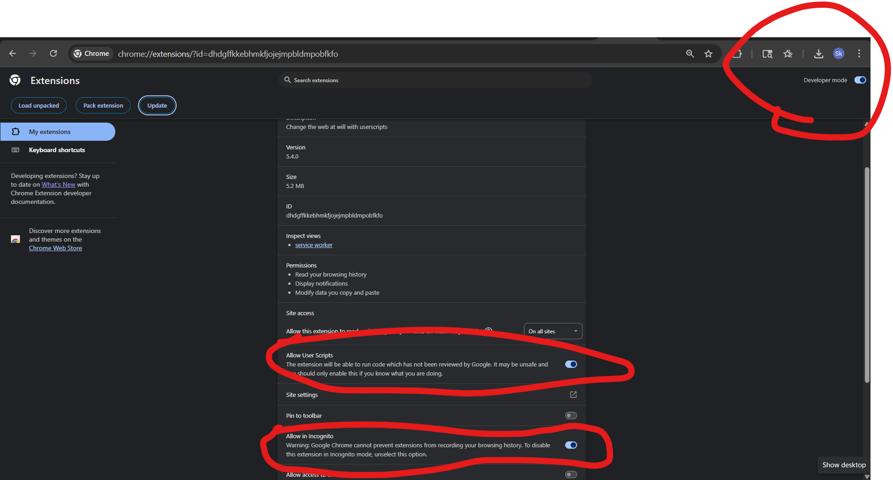
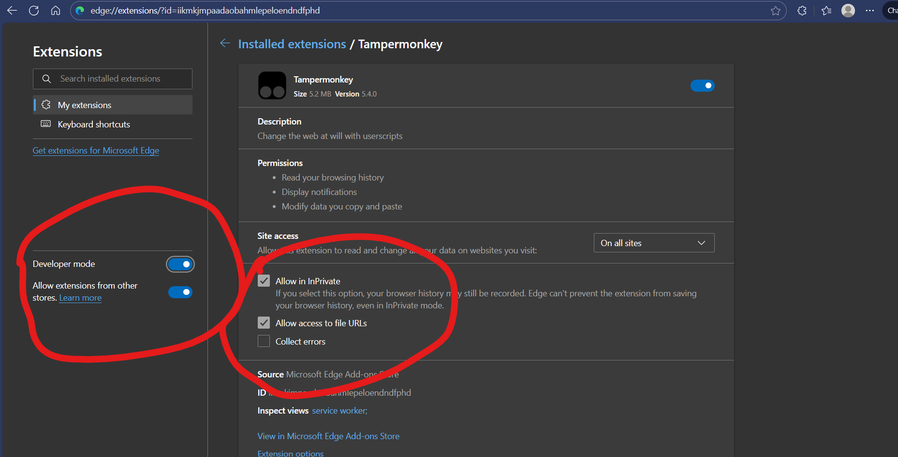

# YouTube → SK Music Redirector

A [Tampermonkey](https://www.tampermonkey.net/) userscript that turns **YouTube and YouTube Music into SK Music**. Open a YouTube video, playlist, channel, or home page — or hit a **Techloq block page** for one — and you land on the matching page of [SK Music](https://skmusic.shalomkarr.workers.dev) instead, instantly, before YouTube ever loads.

## What gets redirected

| You open… | You land on… |
|-----------|--------------|
| A video — `youtube.com/watch?v=ID`, `youtu.be/ID`, `/shorts/ID`, `/embed/ID` | `…/song/ID` |
| A **YouTube Music** track — `music.youtube.com/watch?v=ID` | `…/song/ID` |
| A playlist — `youtube.com/playlist?list=ID` or `music.youtube.com/playlist?list=ID` | `…/playlists/ID` |
| A channel — `youtube.com/channel/UC…` or `music.youtube.com/browse/UC…` | `…/artists/UC…` |
| Home, search, or anything else on YouTube | `…/` (SK Music home) |
| A **Techloq block page** for any of the above (`filter.techloq.com/block-page?redirectUrl=…`) | the matching SK Music page |

A video always wins over a playlist: `…/watch?v=X&list=Y` goes to the **song** (`/song/X`), not the playlist. YouTube **channel handles** (`/@name`, `/c/name`, `/user/name`) can't be turned into a channel ID without an API call, so they go to the SK Music home page.

> **It will not break SK Music's own player.** SK Music plays audio through a hidden `youtube.com/embed` frame. The script matches `youtube.com`, but it exits immediately inside any iframe, so it never touches that player.

## Install

### 1. Install Tampermonkey

| Browser | Get Tampermonkey |
|---------|------------------|
| Chrome / Brave | [Chrome Web Store](https://chromewebstore.google.com/detail/tampermonkey/dhdgffkkebhmkfjojejmpbldmpobfkfo) |
| Edge | [Edge Add-ons](https://microsoftedge.microsoft.com/addons/detail/tampermonkey/iikmkjmpaadaobahmlepeloendndfphd) |
| Firefox | [Firefox Add-ons](https://addons.mozilla.org/firefox/addon/tampermonkey/) |
| Other | [tampermonkey.net](https://www.tampermonkey.net/) |

### 2. Install the script

Click this link with Tampermonkey installed — it opens Tampermonkey's install page; press **Install**:

**→ [Install the YouTube → SK Music Redirector](https://skmusic.shalomkarr.workers.dev/redirector.user.js)**

Or open the in-app [setup page](https://skmusic.shalomkarr.workers.dev/redirector) and click the install button. Tampermonkey auto-updates the script from the same link, so you stay current. (Served from the SK Music origin so it works even where GitHub is blocked.)

### 3. One-time browser setup

Recent Chrome and Edge require you to switch on user scripts for Tampermonkey. Do this once:

- **Chrome / Brave** — go to `chrome://extensions`, open **Tampermonkey → Details**, and turn on **Allow User Scripts**.

  

- **Edge** — go to `edge://extensions`, make sure Tampermonkey is **On**, and enable **Developer mode** (top-right).

  

- **Firefox** — nothing extra; it works after install.

That's it. Open any YouTube link and you'll land on SK Music.

## How it works

- **On YouTube / YouTube Music** (`@run-at document-start`): the script reads the URL, works out the matching SK Music page, calls `window.stop()` to halt YouTube, and `location.replace()`s to SK Music — so YouTube never renders and **Back** doesn't bounce you into it.
- **On a Techloq block page**: it pulls the blocked URL from the `?redirectUrl=` parameter (and, as a fallback, from the block link or page text), maps it, and redirects. If the blocked site isn't YouTube, it does nothing and leaves the block page alone. It polls for up to ~5 minutes in case the block page fills the URL in late.

All the routing lives in one small function (`skTarget`) at the top of [`youtube-to-skmusic.user.js`](youtube-to-skmusic.user.js) — change `SK` there to point at a different SK Music URL if you ever need to.

## Files

```
redirector/
├── youtube-to-skmusic.user.js   # the userscript
├── README.md                    # this tutorial
│                                # (the setup page itself is the in-app /redirector route)
├── chrome.png                   # Chrome "Allow User Scripts" screenshot
└── edge.png                     # Edge setup screenshot
```

## Publishing

This folder lives in the `Shalom-Karr/SK-Music` repo under `redirector/`. The build (`engine/build-static.mjs`) serves the userscript at `https://skmusic.shalomkarr.workers.dev/redirector.user.js` and the setup page is an in-app SPA route at `/redirector` (see `loadRedirector` in `assets/ui.html`); the screenshots ship into `/assets`. The script's `@updateURL` / `@downloadURL` point at the served copy (same origin as the app, so it works behind filters), so pushing to the repo redeploys the site and Tampermonkey auto-updates installs.

---

Built by **Shalom Karr**. Redirects to [SK Music](https://skmusic.shalomkarr.workers.dev) — kosher music, by construction.
